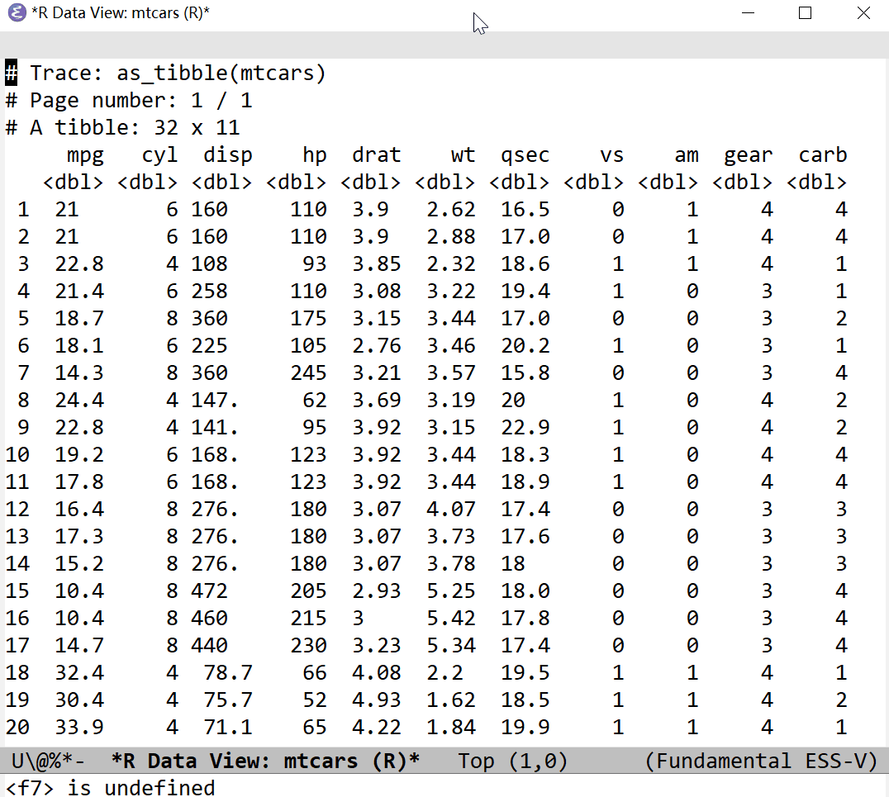

[](https://melpa.org/#/ess-view-data)
[](https://stable.melpa.org/#/ess-view-data)
[](https://github.com/ShuguangSun/ess-view-data/actions)
[](http://www.gnu.org/licenses/gpl-3.0.html)

# ess-view-data

To do tidyverse-like view and manipulate data in ESS and R.

## Installation

Clone this repository, or install from MELPA. Add the following to your `.emacs`:

``` elisp
(require 'ess-view-data)
```

Call `ess-view-data-print`, select a object whichever can be convert to a tibble or data.table depending on the backend, and then a buffer will pop up with data listed/printed. Further verbs can be done, like filter, select/unselect, mutate, group/ungroup, count, unique, summarise, and etc. It can be reset (`ess-view-data-reset`) any time.

To avoid mistaking break the orignial data, it will make a copy (e.g., `as_tibble(dt)` or `as.data.table(dt)`) as default.

If data.table is preferred, just set `ess-view-data-current-backend` to `data.table+magrittr`. Call `ess-view-data-set-backend` to change the backends.

It will put a head information at above:
```r
# Trace: as_tibble(dt) %>% dplyr::filter(PARAMCD == "ORR", CYCLE == 1)
# Last:  %>% dplyr::filter(PARAMCD == "ORR", CYCLE == 1)
# Page number: 1 / 1
# A tibble: 73 x 19
```

- The 'Trace' line tracks the history of actions, and it can be copyed to the code after viewing. **NB** history of the operaitions can be found in buffer `*ESS*`.
- The 'Last' line records the last verb.
- The 'Page number' shows the current page/total number of pages.
- The 'A tibble' show the class and how many rows and columns in the tibble. **NB**, the 'dplyr' backend copies the data.frame to be a tibble first.

## Customization

### ess-view-data-backend-list

- dplyr (default)
- dplyr+DT (out of Emacs, using DT)
- data.table+magrittr

### ess-view-data-print-backend-list

- print (default)
- kable

### ess-view-data-save-backend-list

- write.csv (default)
- readr::write_csv
- data.table::fwrite
- kable

### ess-view-data-complete-backend-list

- jsonlite

### ess-view-data-read-string

- ess-completing-read (default)
- completing-read
- ido-completing-read
- ivy-completing-read


## Usage

**NOTE**: it will make a copy of the data and then does the following action

The entry function to view data:
- [x] ess-view-data-print

In a ess-r buffer or a Rscript buffer, `M-x ess-view-data-print` and input `mtcars`,


Setting:

- [x] ess-view-data-set-backend: change backend
- [x] ess-view-data-toggle-maxprint: toggle limitation of lines per page to print

Verbs:

- [x] ess-view-data-filter


- [x] ess-view-data-select / ess-view-data-unselect


- [x] ess-view-data-sort


- [x] ess-view-data-group / ess-view-data-ungroup
- [x] ess-view-data-mutate
- [x] ess-view-data-slice
- [x] ess-view-data-wide2long / ess-view-data-long2wide
- [x] ess-view-data-update
- [x] ess-view-data-reset
- [x] ess-view-data-unique
- [x] ess-view-data-count


- [x] ess-view-data-summarise


- [x] ess-view-data-overview



- [x] ess-view-data-goto-page / -next-page / -preious-page / -first-page / -last-page / -page-number
- [x] ess-view-data-save

Utitlities:


In indirect buffer, for example, the buffer poped up when ess-view-data-filter is called

- [x] ess-view-data-complete-object: complete or insert the name of one column/variable
- [x] ess-view-data-complete-data: complete or insert the value of one column/variable
- [x] ess-view-data-insert-all-cols: insert names of all columns/variables
- [x] ess-view-data-insert-all-values: insert values of all columns/variables


## TODO

- [ ] row.names support
- [ ] header-line
