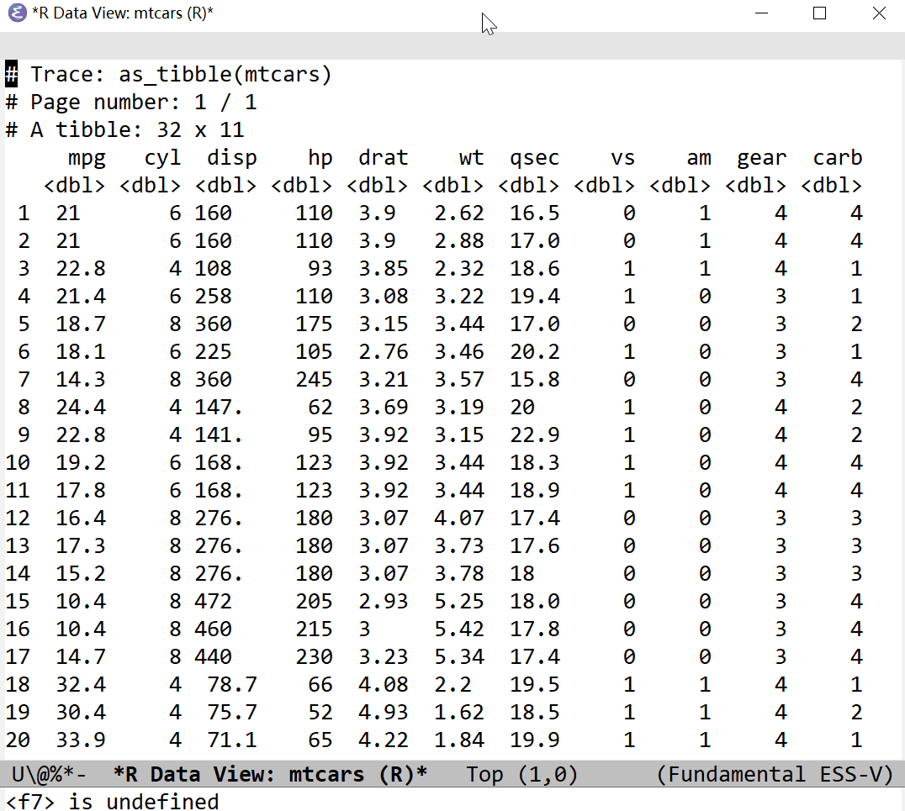

[](https://melpa.org/#/ess-view-data)
[](https://stable.melpa.org/#/ess-view-data)
[](https://github.com/ShuguangSun/ess-view-data/actions)
[](http://www.gnu.org/licenses/gpl-3.0.html)

# ess-view-data

To do tidyverse-like view and manipulate data in ESS and R.

## Installation

Clone this repository, or install from MELPA. Add the following to your `.emacs`:

``` elisp
(require 'ess-view-data)
```

Call `ess-view-data-print`, select a object whichever can be convert to a tibble or data.table depending on the backend, and then a buffer will pop up with data listed/printed. By default the data is rendered as a structured table via `tabulated-list`: column types are shown in the header, numeric columns are right aligned, long cells are truncated and NA values are displayed. Set `ess-view-data-display-backend` to `print` or `kable` to keep the historical text output. Further verbs can be done, like filter, select/unselect, mutate, group/ungroup, count, unique, summarise, and etc. It can be reset (`ess-view-data-reset`) any time.

## Project structure

Since version 1.5 the implementation is split across five files, following
the "core file" pattern: shared ground is extracted into a core module so the
sub-modules only depend downward and there is no circular dependency.

```text
ess-view-data.el           entry: interactive commands, mode map, transient menu
 |-- ess-view-data-core.el       shared config, state, utils, generic API
 |-- ess-view-data-backend.el    verb table, R protocol, dplyr/DT/data.table backends
 |-- ess-view-data-table.el      table display, rendering, scrolling header, sorting
 `-- ess-view-data-complete.el   completion cache and commands
```

`ess-view-data.el` is the only entry point: it `require`s the four sub-modules
in order `core -> backend -> table -> complete`, matching the dependency
direction, so the load order is acyclic. MELPA packages the five files together
and generates the `-pkg.el` automatically; no recipe change is needed.

To avoid mistaking break the original data, it will make a copy (e.g., `as_tibble(dt)` or `as.data.table(dt)`) as default.

If data.table is preferred, just set `ess-view-data-current-backend` to `data.table+magrittr`. Call `ess-view-data-set-backend` to change the backends.

It will put a head information at above:
```r
# Trace: as_tibble(dt) %>% dplyr::filter(PARAMCD == "ORR", CYCLE == 1)
# Last:  %>% dplyr::filter(PARAMCD == "ORR", CYCLE == 1)
# Page number: 1 / 1
# A tibble: 73 x 19
```

- The 'Trace' line tracks the history of actions, and it can be copyed to the code after viewing. **NB** history of the operaitions can be found in buffer `*ESS*`.
- The 'Last' line records the last verb.
- The 'Page number' shows the current page/total number of pages.
- The 'A tibble' show the class and how many rows and columns in the tibble. **NB**, the 'dplyr' backend copies the data.frame to be a tibble first.

## Customization

### ess-view-data-backend-list

- dplyr (default)
- dplyr+DT (out of Emacs, using DT)
- data.table+magrittr

### ess-view-data-print-backend-list

- print (default)
- kable

### ess-view-data-save-backend-list

- write.csv (default)
- readr::write_csv
- data.table::fwrite
- kable

### ess-view-data-complete-backend-list

- jsonlite

### ess-view-data-read-string

- ess-completing-read (default)
- completing-read
- ido-completing-read
- ivy-completing-read

### ess-view-data-display-backend

How to display data in the view buffer:

- table (default): a structured `tabulated-list` view with column types,
  aligned cells, truncated long cells and clickable sort headers.  Long cells
  are re-truncated from the full-value cache whenever a column is widened, and
  the keys below reveal the full values.
- print / kable: the historical text output of the print/kable backends,
  i.e. csv text with the `# Trace` / `# Last` / `# Page number` head lines
  and a csv-mode column header

To restore the historical csv + header view, set it to `print`, e.g.:

``` elisp
;; M-x customize-option RET ess-view-data-display-backend RET print
(setq ess-view-data-display-backend 'print)
```

**NB**: the setting is global; after switching, refresh the current view
buffer with `ess-view-data-reset` or re-run `ess-view-data-print`.

### table display keys

Keys bound in the table display (`ess-view-data-table-mode`):

- `S`: sort by the column at point (server-side `arrange` over the whole data)
- `W`: widen the current column (built-in `tabulated-list-widen-current-column`).
  Cells re-truncate from the full-value cache at the new width, so repeated `W`
  gradually reveals more of every long cell (`M-10 W` widens by 10 columns;
  `M-x tabulated-list-narrow-current-column` narrows and hides again).
- `w`: `ess-view-data-widen-current-column-full` - widen the current column to
  fit its longest full value (not capped by `ess-view-data-column-width-cap`).
- `a`: `ess-view-data-widen-all-columns-full` - widen every column to fit its
  longest full value, so the whole current page enters the buffer as full text
  and Emacs' built-in isearch (`C-s` / `C-r`) can search the full values.
- `v`: `ess-view-data-show-cell-value` - show the full value of the cell at
  point in a read-only buffer (read from the local cache, no R round trip).

After `a`, wide rows may overflow the window and scroll horizontally, which is
expected.  The widened widths apply to the current page only and reset to the
automatic widths on the next render (paging or sorting).

The table header follows horizontal scrolling: it is rebuilt before every
redisplay from the window's current horizontal scroll, so the column names stay
aligned with the data at any scroll position (scroll commands, mouse wheel,
scroll bars and auto-hscroll).  In particular, after `a` you can scroll right
to see the remaining column names instead of only the first few.

### ess-view-data-tibble-crayon-enabled-p

set `ess-view-data-tibble-crayon-enabled-p` to `t` (default) will enable crayon
for tibble if `crayon.enabled` is set in the R's options.

## Usage

**NOTE**: it will make a copy of the data and then does the following action

The entry function to view data:
- [x] ess-view-data-print

In a ess-r buffer or a Rscript buffer, `M-x ess-view-data-print` and input `mtcars`,


Setting:

- [x] ess-view-data-set-backend: change backend
- [x] ess-view-data-toggle-maxprint: toggle limitation of lines per page to print

Verbs:

- [x] ess-view-data-filter


- [x] ess-view-data-select / ess-view-data-unselect


- [x] ess-view-data-sort


- [x] ess-view-data-group / ess-view-data-ungroup
- [x] ess-view-data-mutate
- [x] ess-view-data-slice
- [x] ess-view-data-wide2long / ess-view-data-long2wide
- [x] ess-view-data-update
- [x] ess-view-data-reset
- [x] ess-view-data-unique
- [x] ess-view-data-count


- [x] ess-view-data-summarise


- [x] ess-view-data-overview



- [x] ess-view-data-goto-page / -next-page / -preious-page / -first-page / -last-page / -page-number
- [x] ess-view-data-show-history: show the full action history (Trace/Last) in a separate buffer (in `table` display)
- [x] ess-view-data-save

Utitlities:


In indirect buffer, for example, the buffer poped up when ess-view-data-filter is called

- [x] ess-view-data-complete-object: complete or insert the name of one column/variable
- [x] ess-view-data-complete-data: complete or insert the value of one column/variable
- [x] ess-view-data-insert-all-cols: insert names of all columns/variables
- [x] ess-view-data-insert-all-values: insert values of all columns/variables


## TODO

- [ ] row.names support
- [x] clickable table header for sorting (in `table` display)
- [ ] multi-line header-line (needs Emacs 27+)
